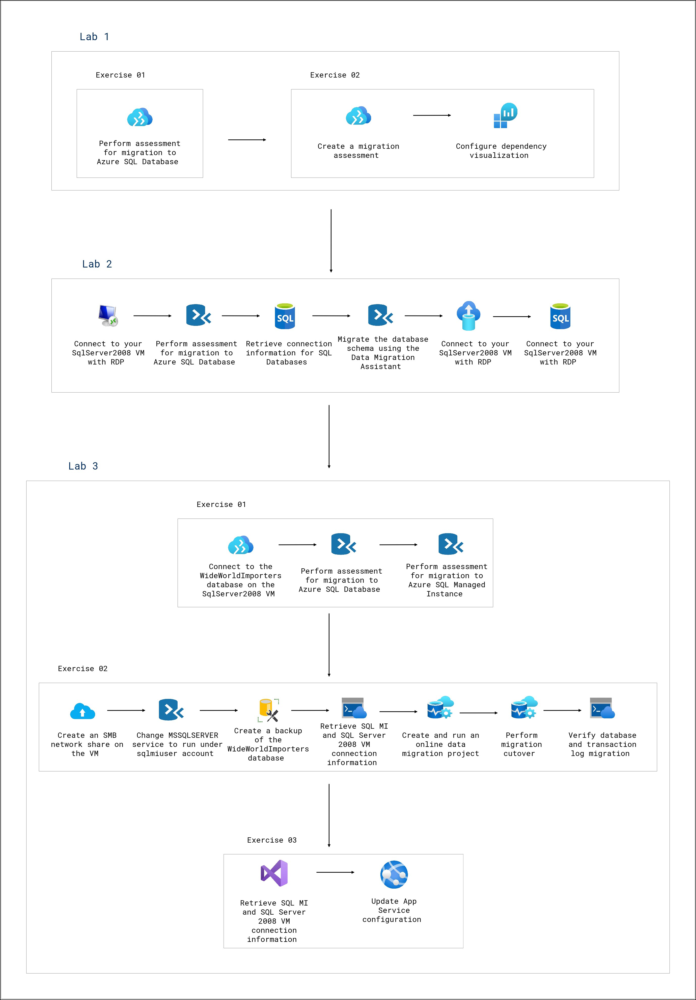
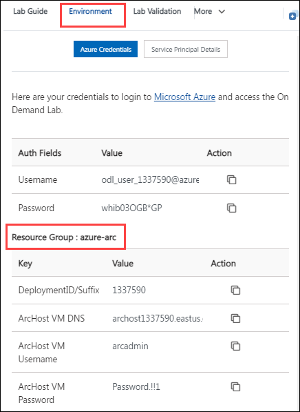

# Migrate and Modernise SQL Servers to Azure
### Overall Estimated Duration: 8 Hours

## Overview
Migrating and modernizing SQL Servers to Azure involves moving on-premises databases to cloud-based solutions like Azure SQL Database, Azure SQL Managed Instance, or SQL Server on Azure VMs. This process includes assessing existing workloads, choosing the appropriate migration approach, and leveraging Azure's cloud-native features for enhanced performance, security, and scalability. Post-migration, organizations benefit from automated backups, high availability, cost optimization, and continuous monitoring, all while reducing operational overhead and improving business continuity.

## Objective
Migrate on-premises SQL Server databases and applications to Azure by creating an Azure Migrate project, assessing workloads, and executing database migrations to both Azure SQL Database and Azure SQL Managed Instance, while updating the web application for seamless integration.

- **Create and Setup Azure Migrate Project and Appliance:** Create an Azure Migrate project and deploy the appliance to collect VM data from your Hyper-V environment for migration analysis.
- **Discover and Assess On-premises Workloads to set up your environment on Azure to Migrate Servers:** use Azure Migrate to create a migration assessment for the application, using the data gathered during the discovery phase.
- **Migrate the on-premises database to Azure SQL Database:** Connect to your SQLServer2008 VM, assess it for Azure SQL migration, migrate the schema and database using migration tools, and configure the application to connect to the SQL Azure Database. 
- **Perform database assessments:** Connect to the database on the SqlServer2008 VM, then assess its migration suitability for both Azure SQL Database and Azure SQL Managed Instance.
- **Migrate the database to SQL MI:** Create an SMB network share, change MSSQLSERVER to sqlmiuser, back up the database, retrieve connection info, run a migration project, perform cutover, and verify migration.
- **Update the web application to use the new SQL MI database:** Deploy the web app to Azure and update the App Service configuration.

## Prerequisites

Participants should have a basic understanding of the following:

- **Azure Migrate:** Familiarity with Azure Migrate for assessing and migrating on-premises workloads.
- **Azure SQL Database & SQL Managed Instance:** Basic knowledge of Azure SQL services and their features.
- **Azure Portal Navigation:** Experience navigating the Azure portal for managing resources.
- **SQL Server Management:** Understanding of SQL Server concepts and operations.
- **Networking Basics:** Familiarity with creating SMB shares and managing network configurations.
- **Web Application Deployment:** Basic knowledge of deploying Web Applications to Azure and configuring App Service settings.

## Architecture
In this migration architecture, SQL Server 2008 databases are assessed for compatibility with **Azure SQL Database** using the **Data Migration Assistant (DMA)**. Dependency visualization ensures smooth migration by mapping application components. The schema is then migrated from **SQLServer2008 VM** to **Azure SQL Database** using DMA. Advanced migration tasks include backups, creating SMB shares, and running an online data migration to **Azure SQL Managed Instance (SQL MI)**. After verifying transaction logs and completing the cutover, **Azure App Service** configurations are updated to connect to the new database endpoints.

## Architecture Diagram

## Explanation of Components
The architecture for this lab involves the following key components:

- **Azure Migrate:** A service that helps assess and migrate on-premises workloads to Azure, providing tools for discovery, assessment, and migration.
- **Azure SQL Database:** A fully managed database service that provides scalability, security, and high availability for SQL workloads in the cloud.
- **Azure SQL Managed Instance (SQL MI):** Offers near 100% compatibility with the SQL Server engine and is designed for easy migration of existing SQL Server workloads to Azure.
- **Azure App Service:** A fully managed platform for building, deploying, and scaling web apps and APIs.
- **SMB Network Share:** A file-sharing protocol used to create shared folders for backups or data transfer in the migration process.

## Getting Started with Your Hybrid Cloud Solution Hands On Lab
Welcome to your Migrate and Modernise SQL Servers to Azure Hands On Lab! We've prepared a seamless environment for you to explore and learn about Azure services. Let's begin by making the most of this experience:

## **Accessing Your Lab Environment**
 
Once you're ready to dive in, your virtual machine and **Lab Guide** will be right at your fingertips within your web browser.
 

## **Virtual Machine & Lab Guide**
 
Your virtual machine is your workhorse throughout the workshop. The lab guide is your roadmap to success.
 
## **Exploring Your Lab Resources**
 
To get a better understanding of your lab resources and credentials, navigate to the **Environment Details** tab.
 

 
## **Utilizing the Split Window Feature**
 
For convenience, you can open the lab guide in a separate window by selecting the **Split Window** icon at the bottom right corner.

 
## **Managing Your Virtual Machine**
 
Feel free to start, stop, or restart your virtual machine as needed from the **Resources** tab. Your experience is in your hands!
 

 
## **Let's Get Started with Azure Portal**
 
1. On your virtual machine, click on the Azure Portal icon as shown below:
 
        

1. You'll see the **Sign into Microsoft Azure** tab. Here, enter your credentials:
 
   - **Email/Username:** <inject key="AzureAdUserEmail"></inject>
 
        
 
1. Next, provide your password:
 
   - **Password:** <inject key="AzureAdUserPassword"></inject>
 
        
 
1. If prompted to stay signed in, you can click **No**.

    
 
1. If a **Welcome to Microsoft Azure** pop-up window appears, simply click **Maybe Later** to skip the tour.
    
1. Now, click on **Next** from the lower right corner to move to the next page.

   

## Support Contact

The CloudLabs support team is available 24/7, 365 days a year, via email and live chat to ensure seamless assistance at any time. We offer dedicated support channels tailored specifically for both learners and instructors, ensuring that all your needs are promptly and efficiently addressed.

Learner Support Contacts:

Email Support: cloudlabs-support@spektrasystems.com
Live Chat Support: https://cloudlabs.ai/labs-support
Now you're all set to explore the powerful world of technology. Feel free to reach out if you have any questions along the way. Enjoy your workshop!

Now you're all set to explore the powerful world of technology. Feel free to reach out if you have any questions along the way. Enjoy your workshop!
