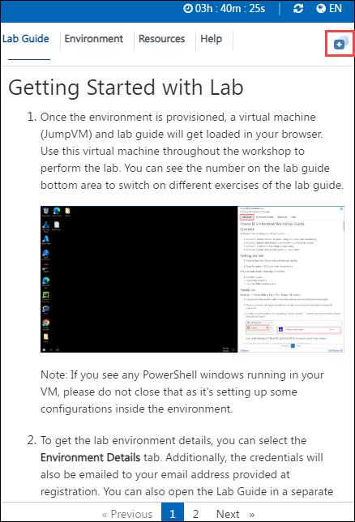

# Migrate and Modernise SQL Servers to Azure
### Overall Estimated Duration: 8 Hours

## Overview
Migrating and modernizing SQL Servers to Azure involves moving on-premises databases to cloud-based solutions like Azure SQL Database, Azure SQL Managed Instance, or SQL Server on Azure VMs. This process includes assessing existing workloads, choosing the appropriate migration approach, and leveraging Azure's cloud-native features for enhanced performance, security, and scalability. Post-migration, organizations benefit from automated backups, high availability, cost optimization, and continuous monitoring, all while reducing operational overhead and improving business continuity.

## Objective
- **Create and Setup Azure Migrate Project and Appliance**
- **Discover and Assess On-premises Workloads to set up your environment on Azure to Migrate Servers**
- **Migrate the on-premises database to Azure SQL Database**
- **Perform database assessments**
- **Migrate the database to SQL MI**
- **Update the web application to use the new SQL MI database**

## **Accessing Your Lab Environment**
 
Once you're ready to dive in, your virtual machine and **Lab Guide** will be right at your fingertips within your web browser.
 

## **Virtual Machine & Lab Guide**
 
Your virtual machine is your workhorse throughout the workshop. The lab guide is your roadmap to success.
 
## **Exploring Your Lab Resources**
 
To get a better understanding of your lab resources and credentials, navigate to the **Environment Details** tab.
 

 
## **Utilizing the Split Window Feature**
 
For convenience, you can open the lab guide in a separate window by selecting the **Split Window** icon at the bottom right corner.

 
## **Managing Your Virtual Machine**
 
Feel free to start, stop, or restart your virtual machine as needed from the **Resources** tab. Your experience is in your hands!
 

 
## **Let's Get Started with Azure Portal**
 
1. On your virtual machine, click on the Azure Portal icon as shown below:
 
        

1. You'll see the **Sign into Microsoft Azure** tab. Here, enter your credentials:
 
   - **Email/Username:** <inject key="AzureAdUserEmail"></inject>
 
        
 
1. Next, provide your password:
 
   - **Password:** <inject key="AzureAdUserPassword"></inject>
 
        
 
1. If prompted to stay signed in, you can click **No**.

    
 
1. If a **Welcome to Microsoft Azure** pop-up window appears, simply click **Maybe Later** to skip the tour.
    
1. Now, click on **Next** from the lower right corner to move to the next page.

   

Now you're all set to explore the powerful world of technology. Feel free to reach out if you have any questions along the way. Enjoy your workshop!
